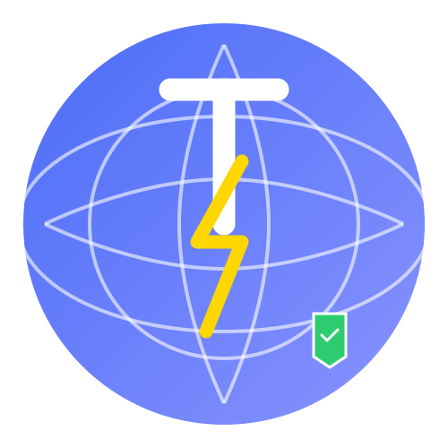

# PowerBrowser

<p align="center">
  
</p>

<p align="center">
  A modern, feature-rich web browser built with HTML, CSS, JavaScript and Python Flask backend.
</p>

## ✨ Features

- **Modern User Interface**: Clean, responsive design with smooth animations
- **Theme Support**: Light mode, dark mode, and system theme integration
- **Tab Management**: Create, close, and navigate between multiple tabs
- **Empty Tab Page**: Customizable new tab page with quick links
- **Incognito Mode**: Private browsing that doesn't record history
- **Bookmarks System**: Save and organize your favorite websites
- **Browsing History**: Track and manage your browsing activity
- **Security Features**: Block cookies, trackers, and ads
- **System Monitoring**: Real-time CPU and memory usage tracking
- **Google Search Integration**: Search directly from the address bar

## 🏗️ Project Structure

```
PowerBrowser/
├── backend/
│   └── server.py         # Flask backend API
├── frontend/
│   ├── css/
│   │   └── style.css     # Main stylesheet
│   ├── js/
│   │   └── script.js     # Main JavaScript file
│   ├── images/           # Icons and logos
│   └── index.html        # Main HTML file
├── run_powerbrowser.sh   # Startup script
└── README.md             # Project documentation
```

## 🚀 Getting Started

### Prerequisites

- Python 3.x
- Flask
- Flask-CORS
- psutil

### Installation

1. Clone the repository
   ```bash
   git clone https://github.com/yourusername/PowerBrowser.git
   cd PowerBrowser
   ```

2. Install Python dependencies
   ```bash
   pip install flask flask-cors psutil requests
   ```

3. Start the backend server
   ```bash
   cd backend
   python server.py
   ```

4. Open the browser
   - Navigate to `http://localhost:5000` in your web browser
   - Or use the provided run script:
     ```bash
     chmod +x run_powerbrowser.sh
     ./run_powerbrowser.sh
     ```

## 💻 Usage

- Enter a URL in the address bar or search
- Click the + button to open a new tab
- Click the X button to close tabs
- Click the gear icon for settings
- Click the shield icon for security center
- Right-click on tabs for additional options
- Toggle between light and dark mode in settings

## 🔧 API Endpoints

| Endpoint | Method | Description |
|----------|--------|-------------|
| `/api/tabs` | GET | Get all tabs |
| `/api/tabs` | POST | Create a new tab |
| `/api/tabs/:id` | PUT | Update a tab |
| `/api/tabs/:id` | DELETE | Delete a tab |
| `/api/history` | GET | Get browsing history |
| `/api/history` | POST | Add to history |
| `/api/history` | DELETE | Clear history |
| `/api/bookmarks` | GET | Get all bookmarks |
| `/api/bookmarks` | POST | Add a bookmark |
| `/api/bookmarks/:id` | DELETE | Delete a bookmark |
| `/api/settings` | GET | Get browser settings |
| `/api/settings` | PUT | Update settings |
| `/api/security` | GET | Get security stats |
| `/api/security/scan` | POST | Run security scan |
| `/api/security/incognito` | POST | Toggle incognito mode |
| `/api/system-stats` | GET | Get system statistics |

## 👨‍💻 Technologies

- **Frontend**: HTML, CSS, JavaScript
- **Backend**: Python, Flask, Flask-CORS
- **System Monitoring**: psutil

## 🔐 Security Features

- Tracker blocking
- Ad blocking
- HTTPS enforcement
- Cookie control
- Security scanning
- Incognito mode

## 🤝 Contributing

Contributions are welcome! Please feel free to submit a Pull Request.

## 📜 License

This project is licensed under the MIT License.

## 📋 Copyright

© 2025 PowerBrowser. All rights reserved.
